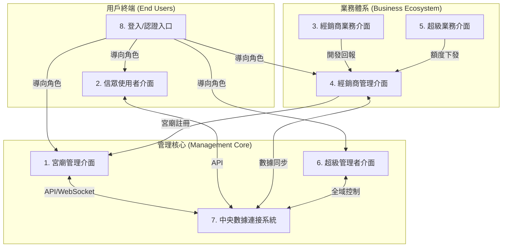

# ⛩️ 寺廟智慧管理系統 - 全域架構藍圖 (System Blueprint)

> [!IMPORTANT]
> 本文件為系統邏輯的「單一真理來源 (Single Source of Truth)」。
> 若修改此文件中的 Mermaid 圖表或關聯描述，請告知 AI 助手進行代碼同步寫入。

## 1. 系統全視圖 (System Panorama)

## 2. 模組功能定義與 XState 狀態對位

| 模組 ID | 模組名稱 | 核心 XState 狀態 | 關鍵數據關聯 (Dependency) |
| :--- | :--- | :--- | :--- |
| **M1** | 宮廟管理介面 | `temple_admin_active` | 活動 ID, 表單 ID, 信眾 ID |
| **M2** | 信眾使用者介面 | `guest_active` | 預約 ID, 點燈 ID, AI 諮詢內容 |
| **M3** | 經銷商業務介面 | `sales_reporting` | 開發進度, 拜訪記錄 |
| **M4** | 經銷商管理介面 | `distributor_admin` | 團隊名單, 佣金比率, 宮廟審核狀態 |
| **M5** | 超級業務介面 | `super_sales_control` | 全台配額, 獎金池 |
| **M6** | 超級管理者介面 | `super_admin_master` | 系統版本, 全域安全性, 費率設定 |
| **M7** | 中央數據連接系統 | `data_bridge_sync` | 跨模組資料庫, WebSocket 推送 |
| **M8** | 登入/認證入口 | `authentication_flow` | Token, Role, Permissions |

## 3. 模組間通訊協定 (Communication Protocols)

- **M1 <-> M2**: 透過 M7 進行實時通知。當 M1 發布新活動，M2 觸發 `NOTIFY_NEW_EVENT`。
- **M4 <-> M1**: 經銷商 M4 審核通過後，自動調用 M7 創建 M1 的宮廟空間。
- **M6 <-> ALL**: M6 擁有全模組的 `OVERRIDE` 權限，可進行緊急關閉或數據修正。

---

## 🛠️ 開發同步記錄 (AI Sync Log)
- [2026-05-07] 建立架構文件，定義 8 大模組與 Mermaid 關聯圖。
- [2026-05-07] 實作 M1 活動設定與 M7 數據連接基礎。
